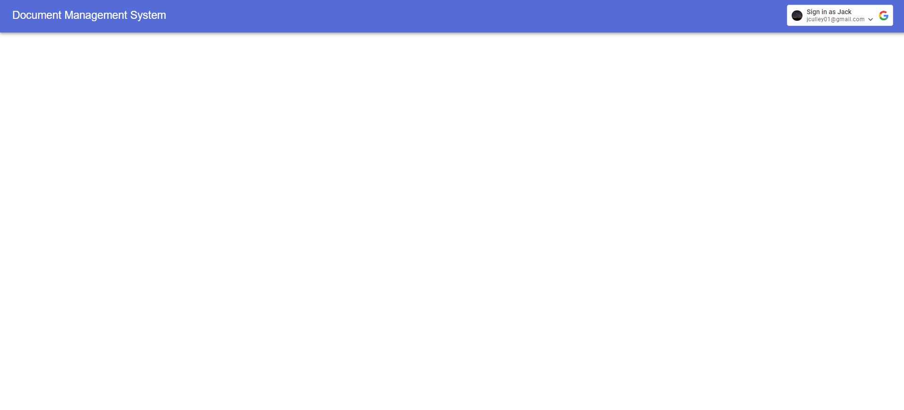
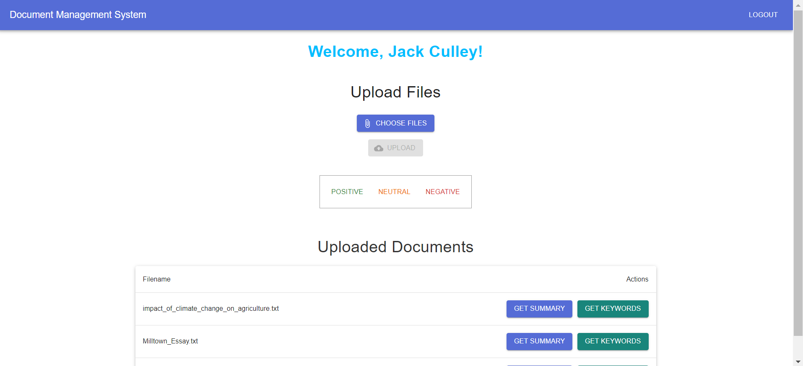
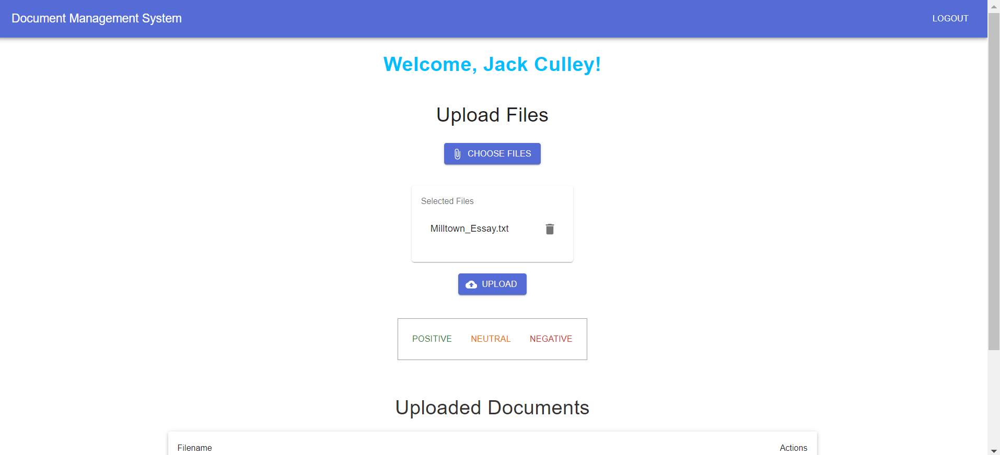
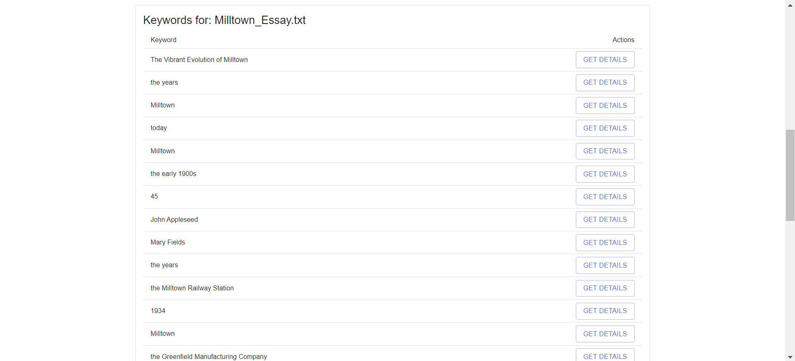
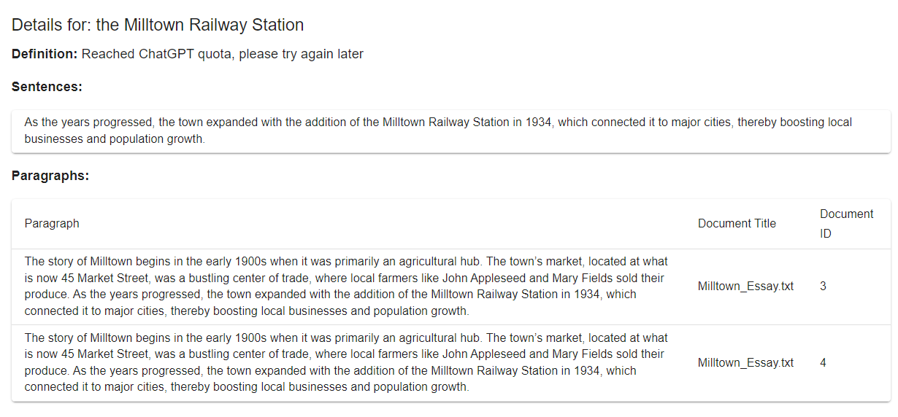
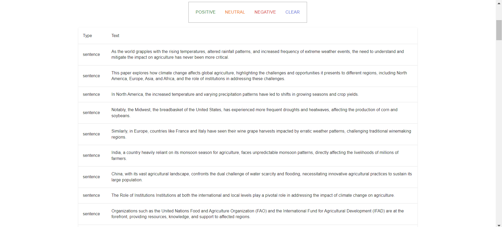
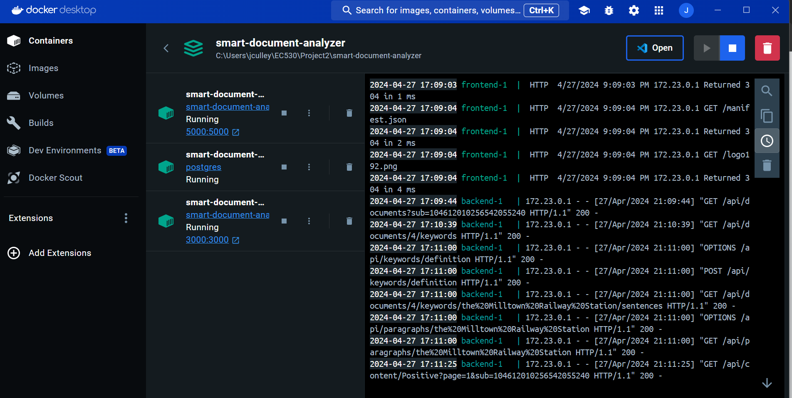

# Smart Document Analyzer

## Desciption
Smart Document Analyzer is a comprehensive platform designed to enhance document management through advanced processing techniques. The platform offers secure upload capabilities, document conversion, sentiment analysis, keyword extraction, topic tagging, summarization, and more, providing an all-encompassing solution for document analysis needs.

## Features

- Document Upload: Securely uploads documents: PDFs, images, text files, etc.
- Text Conversion: All uploaded documents are converted to text to perform analysis.
- Keyword Extraction: Identifies and tags keywords within documents and paragraphs.
- Sentiment Analysis: Analyzes and classifies the sentiment of paragraphs and sentences.
- Summarization: Automatically generates summaries for documents using ChatGPT API 3.5 turbo.
- Definition: Provides definitions for all key words using ChatGPT API 3.5 Turbo.
- Entity Recognition: Extract names, locations, and institutions from documents.
- Search Functionality: Perform searches within paragraphs based on keywords and retrieve keyword definitions.

## Prerequisites

Before you begin, ensure that you have the following software installed on your system:

- **Docker**: Required to create, deploy, and run applications by using containers. [Download Docker](https://www.docker.com/get-started)
- **Docker Compose**: Required for running multi-container Docker applications. Typically included with Docker Desktop for Windows and Mac. [Docker Compose Documentation](https://docs.docker.com/compose/)

These tools will help you to encapsulate your application, its environment, and dependencies in a container that can be easily run on any Docker-compatible system.

## Getting Started with Docker

To start using the Smart Document Analyzer with Docker, follow these steps:

1. **Clone the repository**:
   ```bash
   git clone https://github.com/jculley01/smart-document-analyzer.git
   cd smart-document-analyzer
    ```
2. **Build and run your docker containers**
    ```bash
    docker-compose up --build
    ```
    This command will start all the services defined in your docker-compose.yml file. Here's what each service does:

- db: This service runs a PostgreSQL database configured with your specified environment variables.
- backend: This service builds and runs the Flask backend, available at localhost:5000.
- frontend: This service builds and runs the React frontend, available at localhost:3000.

3. **Access the application**
- The frontend can be accessed at http://localhost:3000.
- The backend API is available at http://localhost:5000.

4. **Shutting Down**
```bash
docker-compose down
```
Optionally, you can use this command to remove the volumes along with the containers, which is useful if you want to reset the database to a clean slate.

```bash
docker-compose down -v
```

## Demo
https://drive.google.com/file/d/1k0UFtQoVwsvJGqp-D9baBAP2JQRSBe9u/view?usp=sharing

## System Architecture

The system employs a Python Flask server to establish a REST API gateway, facilitating data exchanges with the React frontend web application. This gateway serves as the primary conduit for sending and receiving data, ensuring seamless interaction between the user interface and the backend. Additionally, the Flask server interacts with a PostgreSQL database to store and retrieve all necessary data, supporting frontend functionalities. To enhance deployment and scalability, each component of the system—Flask server, PostgreSQL database, and React frontend—is containerized using Docker. These containers are orchestrated with Docker Compose, allowing them to be managed as a unified service. This containerization strategy streamlines development, testing, and production workflows, ensuring consistency across different environments and simplifying system maintenance and scalability.

## Testing

Unit tests have been developed for some of the functions and are integrated with Github actions via a yaml file. 

## Images








